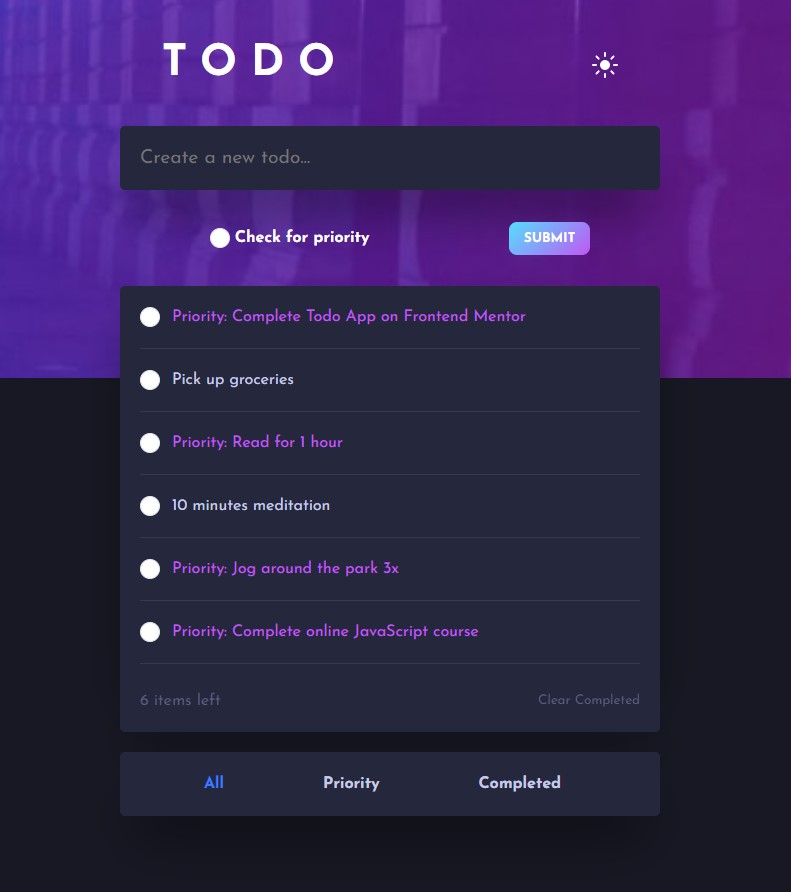

# Todo App

**This is a simple to-do application that allows users to add, delete and filter to-do items.**

## Screenshot



## Features

- Add new to-do items by typing in the input field and clicking on the "Submit" button or pressing the "Enter" key
- Mark to-do items as priority by checking the "priority" checkbox
- Delete to-do items by clicking on the "X" button next to each item
- View all to-do items, only priority items, or only completed items by clicking on the corresponding buttons
- Keep track of the number of items remaining in the list

## Technologies used

- HTML
- CSS
- JavaScript

### Links

- Solution URL: [GitHub Repository](https://github.com/ninogogol/Todo-app)
- Live Site URL: [GitHub Page](https://ninogogol.github.io/Todo-app/)

### Note

**The code includes an alert message that will be displayed to the user if they try to submit an empty text input. The message is displayed using the alert() function and the text displayed is "Please enter a valid todo item". This message appears in the handleClick() function, specifically in the following code block:**
```
if(todoItemValue === '') {
    alert('Please enter a valid todo item')
    return ''
}
```
**This check is made to ensure that the user cannot submit an empty to-do item. If the input field is empty, the function will display the alert message and return without adding a new to-do item to the list.**

### Frontend Mentor challenges

[Frontend Mentor](https://www.frontendmentor.io/challenges/todo-app-Su1_KokOW)

## Author

- Linkedin - [Nino Gogoladze](https://www.linkedin.com/in/nino-gogoladze-80a075227/)